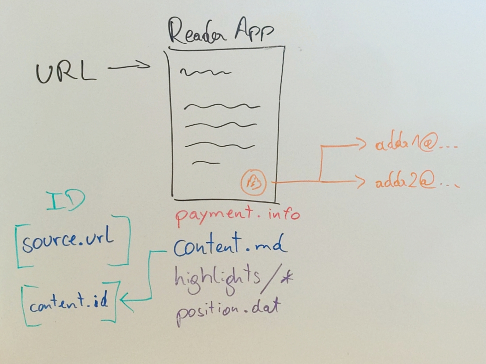

# VAT - Value-Added Text

The idea of this system is incredibly simple: let users pay for the content they consume, _voluntarily_. 

All that is needed, basically, is _text_ and _payment information_. Or, to make things more concrete:

- A markdown file
- A lightning address

