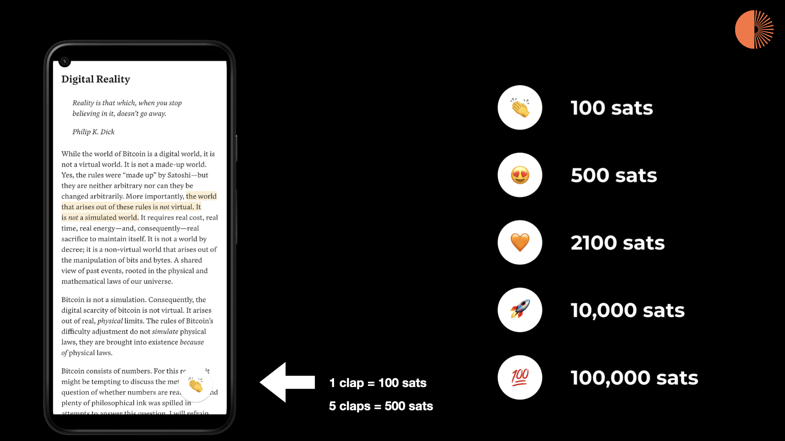

# VAT - Value-Added Text

The idea of this system is incredibly simple: let users pay for the content they consume, _voluntarily_. 

All that is needed, basically, is _text_ and _payment information_. Or, to make things more concrete:

- A markdown file
- A lightning address

Once you have that, you can build a _Reader App_ that takes the text, displays it nicely to the user (without any ads or other bullshit) and—if lightning payments are integrated natively—allows the reader to send value to the author _directly_.

Imagine an app like [Pocket](https://getpocket.com/) or [Instapaper](https://www.instapaper.com/), but lightning-native. Every action can be a payment: send 1000 sats when you archive an article; send 10 sats for every paragraph read; send 5000 sats when you add it to your favorites; send **100 sats with every clap**.



## Reader Data-Structure

The reader app will create a **local copy of the content**, e.g. from a source URL.

```
Input URL: https://dergigi.com/2022/10/02/bitcoin-is-digital-scarcity/
```

From this input URL, the following file structure will be generated:

- `content.md` - clean markdown file with just the text (no ads, no other bs)
- `payment.nfo` - one or multiple lightning addresses

The reader app will store additional metadata on usage:

- `position.dat` - reading position
- `highlights/*` - highlights made by the user
- `comments/*` - comments made by the user

This metadata should be stored in open formats and should be shareable (if the user wants to make this data public, that is).

---


